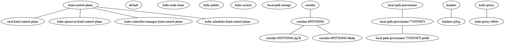

# kraph

Kubernetes graph experiment

# HOWTO

**NOTE:** You must have `kubeconfig` properly configured

Get all dependencies:
```shell
go get
```

Run tests
```shell
go test
```

Build kraphctl:
```shell
go build cmd/kraphctl/main.go -o kraphctl
```

Run `kraphctl`:
```shell
./kraphctl | dot -Tpng > foo.png && open foo.png
```

# Example

vanilla [kind](https://kind.sigs.k8s.io/) cluster:


